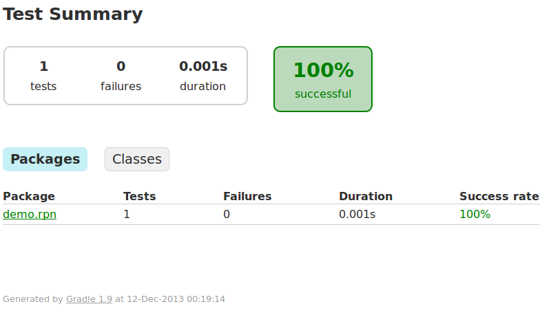
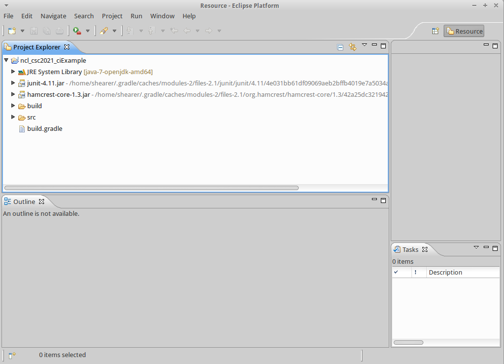
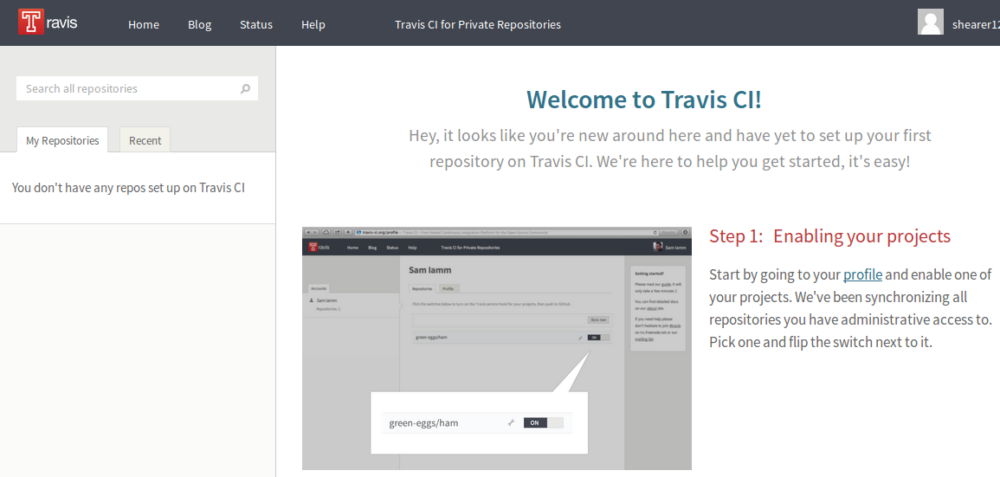
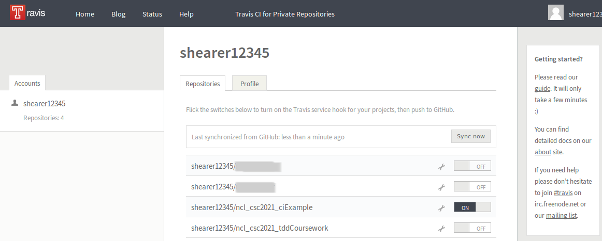
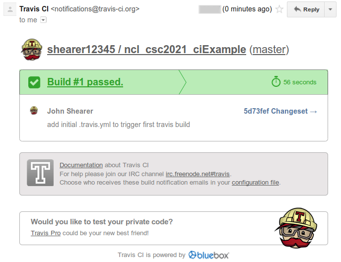
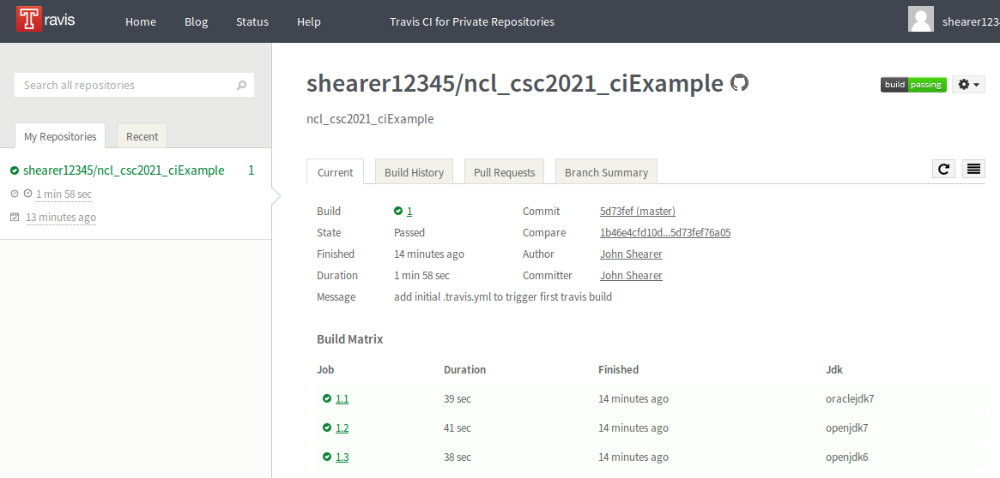
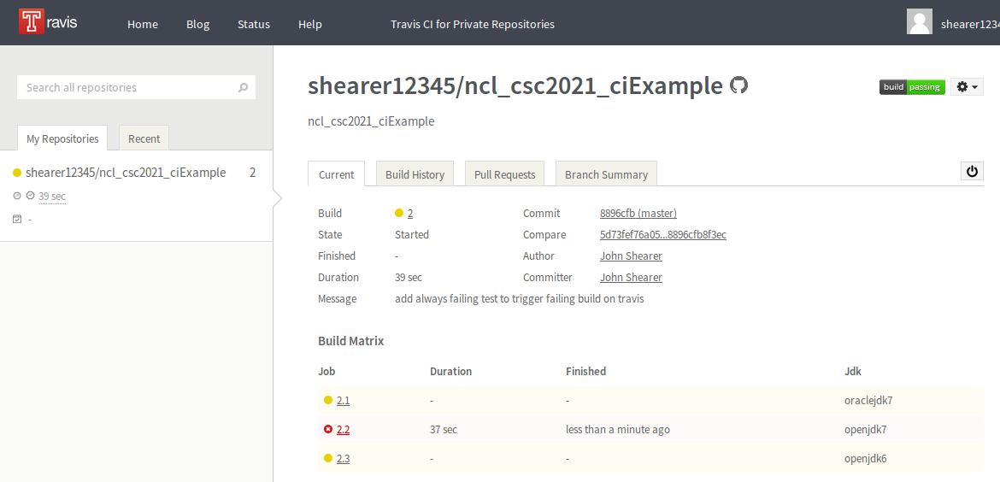

##Continuous Integration - Lecture


###What is Continuous Integration?

>Continuous integration (CI) is the practice, in software engineering, of merging all developer working copies with a shared mainline several times a day.
> CI was originally intended to be used in combination with automated unit tests written through the practices of test-driven development.
  -- [http://en.wikipedia.org/wiki/Continuous_integration](http://en.wikipedia.org/wiki/Continuous_integration)


###What is Continuous Integration? 2

>Later elaborations of the concept introduced build servers, which automatically run the unit tests periodically or even after every commit and report the results to the developers. The use of build servers (not necessarily running unit tests) had already been practised by some teams outside the XP community. Nowadays, many organisations have adopted CI without adopting all of XP.
  -- [http://en.wikipedia.org/wiki/Continuous_integration](http://en.wikipedia.org/wiki/Continuous_integration)

- XP (eXtreme Programming) in a type of *Agile-methodology*
  - http://en.wikipedia.org/wiki/Agile_software_development


###What CI tools exist?

- TravisCI - [https://travis-ci.org/](https://travis-ci.org/)
- Jenkins - [http://jenkins-ci.org/](http://jenkins-ci.org/)
- Hudson - [http://hudson-ci.org/](http://hudson-ci.org/)
- BuildBot - [http://buildbot.net/](http://buildbot.net/)
- ...


###Nightly Builds

- 'Nightly Builds' are versions of software built automatically (overnight) for a project
- You've probably used the results of these tools already
- CI tools just take the ideas of build servers further, and incorporate lots of automated testing
  - building **all** the time (on every commit)


##Build Automation

- We're mostly used to building things manually:
  - from Eclipse
  - from the command line
  - from Visual Studio
  - etc
- Continuous Integration needs to build software automatically
  - as well as manage dependencies and other setup/teardown


###Build Automation Tools

- Build automation tools exist for this (and other) purposes
- We'll be using Java next term for testing, so we'll focus on Java build automation tools
- but, build automation tools exist for every language/platform/etc

- Java options include:
  - Ant - [http://ant.apache.org/](http://ant.apache.org/)
  - Maven - [http://maven.apache.org/](http://maven.apache.org/)
  - Gradle - which we'll use here - [http://www.gradle.org/](http://www.gradle.org/)


###Gradle?

>Gradle can automate the building, testing, publishing, deployment and more of software packages ... -- http://www.gradle.org/

>Gradle [is a] ... tool to handle all build and release related activities for java projects -- http://java.dzone.com/articles/gradle-maven-perspective


##Principles of Continuous Integration


###Advantages

http://www.thoughtworks.com/continuous-integration

- Say goodbye to long and tense integrations
- Increase visibility which enables greater communication
- Catch issues fast and nip them in the bud
- Spend less time debugging and more time adding features
- Proceed in the confidence you’re building on a solid foundation
- Stop waiting to find out if your code’s going to work
- Reduce integration problems allowing you to deliver software more rapidly


###Practices

http://martinfowler.com/articles/continuousIntegration.html#PracticesOfContinuousIntegration

1) Automate the build
2) Make the build self-testing
3) Everyone commits to the baseline every day
4) Every commit (to baseline) should be built
5) Keep the build fast
6) Test in a clone of the production environment
7) Make it easy to get the latest deliverables
8) Everyone can see the results of the latest build
9) Automate deployment


###How to in practice

- Developers check out code into their private workspaces.
- When done, the commit changes to the repository.
- The CI server monitors the repository and checks out changes when they occur.
- The CI server builds the system and runs unit and integration tests.
- The CI server releases deployable artefacts for testing.
- The CI server assigns a build label to the version of the code it just built.
- The CI server informs the team of the successful build.
- If the build or tests fail, the CI server alerts the team.
- The team fix the issue at the earliest opportunity.
- Continue to continually integrate and test throughout the project.


##More refs

- http://electric-cloud.com/plugins/continuous-integration/
- http://www.rackspace.com/blog/the-business-advantages-of-continuous-integration/
- http://blogs.agilefaqs.com/2014/10/03/key-principles-for-reducing-continuous-integration-build-time/


##Hands on

- we'll look at setting up and using the Travis Continuous Integration web service
  - a hosted continuous integration service for the open source community
  - as above, many other CI tools and services are available
  - [http://travis-ci.org](http://travis-ci.org)

- we'll be using a project setup by gradle
  - using the Java plugin
  - and the Eclipse plugin


##Gradle Setup


###Install Gradle

- Gradles runs on all major platforms
  - Windows
  - Linux
  - OS X


####Install Gradle - Linux

- http://www.gradle.org/get-started
  - download and unpack gradle
  - add ```GRADLE_HOME/bin``` to your PATH environment variable
    - add ```PATH=$PATH:~/code/gradle-2.2.1/bin``` to ~/.profile
      - (your gradle version may be different)
    - re-login
- or (on Ubuntu)
  ```bash
  add-apt-repository ppa:cwchien/gradle
  apt-get update
  apt-get install gradle
  ```


####Install Gradle - Windows

- http://www.gradle.org/get-started
  - download gradle
  - unpack gradle to somewhere you choose
  - add that location to the PATH
  - open a new command window


###Verify Gradle works

- Verify your installation works by simply typing ```gradle```
  - your version may be different

```bash
shearer@darkwing:~/code/ncl_csc2021_ciExample$ gradle
:help

Welcome to Gradle 1.9.

To run a build, run gradle <task> ...

To see a list of available tasks, run gradle tasks

To see a list of command-line options, run gradle --help

BUILD SUCCESSFUL
```


###Create a build.gradle file

- http://www.gradle.org/docs/current/userguide/tutorial_java_projects.html

```gradle
apply plugin: 'java'
apply plugin: 'eclipse'

repositories {
    mavenCentral() }

dependencies {
    testCompile group: 'junit', name: 'junit', version: '4.+' }

sourceCompatibility = 1.5
version = '0.1'
jar {
    manifest {
        attributes 'Implementation-Title': 'ncl_csc2021_ciExample',
                   'Implementation-Version': version
    }
}
```


###Create Initial Project Structure

- Gradle prefers convention over configuration
- Gradle's default assumptions about project structure mirror those of Maven.
  - [http://maven.apache.org/guides/introduction/introduction-to-the-standard-directory-layout.html](http://maven.apache.org/guides/introduction/introduction-to-the-standard-directory-layout.html)
- in the project directory create:
  - ```src```
  - ```src/main/```
  - ```src/main/java```
  - ```src/test```
  - ```src/test/java```
  - ```bash
  mkdir -p src/main/java src/main/resources src/test/java
  ```


##Testing Gradle

- add some code
- runs the tests from gradle


###Add some test code and production code

- code from Brett Schuchert's RpnCalculator - http://schuchert.wikispaces.com/gradle.GettingStarted


###Run Gradle tests

- simple as ```gradle test```

```bash
shearer@darkwing:~/code/ncl_csc2021_ciExample$ gradle test
:compileJava
:processResources UP-TO-DATE
:classes
:compileTestJava
:processTestResources UP-TO-DATE
:testClasses
:test

BUILD SUCCESSFUL

Total time: 5.567 secs
shearer@darkwing:~/code/ncl_csc2021_ciExample$xample$
```


###View Gradle tests

- when Gradle runs, if all the tests pass, the output just shows that the test task executed.
- but, it also produces test output files, at:
  - ```build/reports/tests/index.html```




##Creating Eclipse projects from gradle

- http://www.gradle.org/docs/current/userguide/eclipse_plugin.html
- add the eclipse plugin to your gradle file
  - ```apply plugin: 'eclipse'```
- generate all Eclipse configuration files with gradle
  - ```gradle eclipse```


##Import the Eclipse project

- File->Import->General->Existing Projects into Workspace
  - ```PATH_FOR_ncl_csc2021_ciExample\```




###Add gradle to your IDE

- http://www.gradle.org/tooling
- Eclipse
  - http://gradle.org/docs/current/userguide/eclipse_plugin.html
  - https://github.com/spring-projects/eclipse-integration-gradle/
- we're going to skip this


##Push to github

- create a new repository if you need, follow github instructions
- ```git push```
- [https://github.com/shearer12345/ncl_csc2021_ciExample](https://github.com/shearer12345/ncl_csc2021_ciExample)


##Getting Started with Travis CI

- [http://about.travis-ci.org/docs/user/getting-started/](http://about.travis-ci.org/docs/user/getting-started/)


###Step one: Sign in

- To get started with Travis CI, sign in through GitHub OAuth.
- Go to Travis CI and follow the Sign In link at the top.

- GitHub will ask you to grant read and write access.
- Travis CI needs write access for setting up service hooks for your repositories when you request it, but it won't touch anything else




###Step two: Activate GitHub Service Hook

- Once you're signed in go to your profile page.
- You'll see a list of your repositories.
- Flip the on/off switch for each repository that you want to hook up on Travis CI.
- Then visit the GitHub service hooks page for that project and paste your GitHub username and Travis token into the settings for the Travis service if it is not already pre-filled.




###Step three: Add .travis.yml file to your repository

- In order for Travis to build your project, you need to tell the system a little bit about it.
- To do so, add ```.travis.yml``` to the root of your repository.
- If ```.travis.yml``` is not in the repository, is misspelled or is not valid YAML, travis-ci.org will ignore it, assume Ruby as the language and use default values for everything.

- our ```.travis.yml``` will look like this:

```yaml
language: java
jdk:
  - oraclejdk7
  - openjdk7
  - openjdk6
```

- http://docs.travis-ci.com/user/languages/java/


###Step four: Trigger Your First Build With a Git Push

- once GitHub hook is set up
- push your commit that adds ```.travis.yml``` to your repository
- that should add a build into one of the queues on Travis CI and your build will start as soon as one worker for your language is available

``` bash
git add .travis.yml
git commit
git push
```








##CI for other projects

- https://travis-ci.org/shearer12345/graphics_examples_in_git_branches

- CI on github pull requests
  - https://travis-ci.org/shearer12345/graphics_examples_in_git_branches/pull_requests
  - add the build status to the github pull request conversation
    - see https://github.com/shearer12345/graphics_examples_in_git_branches/pull/8
    - look for the green tick (then hover)
  