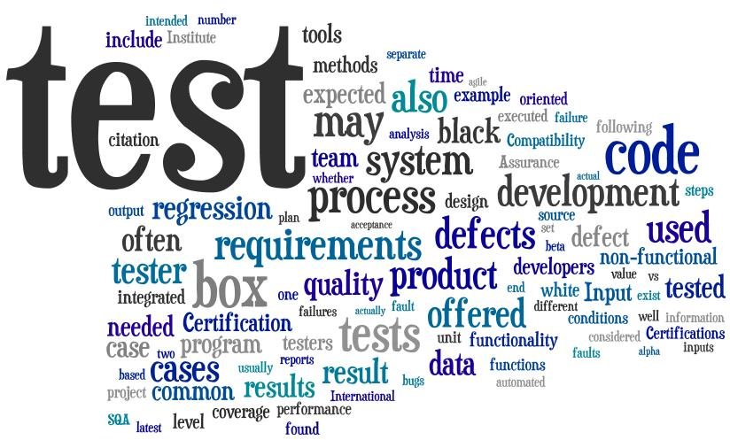

##Introduction to Testing - Lecture


##What is testing?

- ???




- http://blog.algoworks.com/wp-content/uploads/2013/09/Software-testing-trends-2013.jpg


##Let's start with Wikipedia!!

> Software testing is an investigation conducted to provide stakeholders with information about the quality of the product or service under test -- http://en.wikipedia.org/wiki/Software_testing


##Let's unpick that a little - what does that mean?


> Software testing is an investigation

- a process, that we expect to produce some results
- what kinds of results?
	- ???


> to provide stakeholders

- which stakeholders?
	- ???


> information about the quality of the product or service

- what do we mean by quality?
	- ???


##What does testing **not** do?

- ???


- Testing can never completely identify all the defects within software

	- we cannot test software under **all** conditions.
	- with modeling/formal methods approaches we *could* prove that some software will 'work' under **all** conditions, for some kinds of programs, with appropriately detailed specifications etc.


##What things, other than software bugs can also cause errors/failures?

- ???


###memory corruption by other programs

in theory the OS should prevent this, but can you prove that the OS has no errors


###data corruption

- storage medium corruption
- data transfer corruption
	- on the network
	- can we detect this?
	- what sorts of impacts can this have


###physical errors

- ???


###incorrectly implemented hardware

e.g. Pentium FDIV bug

- The error was rarely encountered by users (Byte magazine estimated that 1 in 9 billion floating point divides with random parameters would produce inaccurate results).

- Intel ultimately recalled the defective processors.

- Intel said there were a few missing entries in the lookup table used by the company.

-- http://en.wikipedia.org/wiki/Pentium_FDIV_bug


###electrical / magnetic interference

- something causes a single bit of dynamic random-access memory (DRAM) to spontaneously flip to the opposite state

- initially thought due to alpha particles emitted by contaminants in chip packaging material


  - http://img.misco.eu/resources/images/products/106/HWP/50/500670-B21//500670-B21_1600x1600.jpg


- research has shown that the majority of one-off ("soft") errors in DRAM chips occur as a result of background radiation
	- chiefly neutrons from cosmic ray secondaries
	- which may change the contents of one or more memory cells or interfere with the circuitry used to read/write them
	- -- http://en.wikipedia.org/wiki/ECC_memory

- partially mitigated by using Error-correcting code memory (ECC) -- http://en.wikipedia.org/wiki/ECC_memory


###physical failure

- component failure(s)

- permanent (good) vs transient (bad!)


##Getting Started with JUnit


##Overview

For practice with JUnit we're going to make some parts of a simple calculator. There are lots of already working calculators which are useful as a concrete model of what functionality you'll want from your calculator.

  - e.g. the default Windows calculator
  - or e.g. Google's online calculator (http://www.google.co.uk/search?q=online+calculator)
  - or any other other


You can use one of these calculators to figure out the sequences of actions that cause what kinds of outputs.


- We will not be creating a UI for our calculator.
- Not even a command-line interface.
- Our calculator will have methods we can call that are equivalent to one or more button presses on a normal calculator.


For the practicals you can choose exactly what level you choose to emulate:

  - you could emulate each button press with a method
  - or, you could only emulate operation buttons directly with methods, and have an "enterANumber" method that takes an int/float (thus saving emulating all the button presses to entere numbers with more than one digit


- This calculator approach is similar to some videos that you may find useful

  - Brett Schuchert's RpnCalculatorInJavaSeries -http://vimeo.com/album/205252


##Test-Driven Development

We'll be using a Test-Driven Development approach.

This means we'll follow this sequence:

  1. Write a failing test (RED phase)
  2. Write production code to *only* make that test pass (and not break any others) (GREEN phase)
    - then commit
  3. Refactor (optional)


- That means the first thing to do for any new feature is to come up with a test for it
  - in fact, you'll probably need more than one
  - but we'll do development one test at a time
  - so just put the other tests you think you'll need in a list somewhere (in your source, as comment, is fine)


- only consider the most basic features at this point - don't worry about trying to consider all features
- we're only spending a small amount of time on this calculator as practice, so we don't expect to build much at all


##Features for our calcualtor

For the purposes of this practice, we want to have just a few features. If you achieve something like this list, with tests and production code, you should have progressed enough to be comfortable with the coursework.


1. We should be able to create a new calculator
2. The calculator should be able to return its present value (equivalent to pressing the 'equals' button)
	- for a new calculator this value should be zero
3. We should be able to enter a number into a new calculator and when we get the calculator's value it should be that same number
4. We should be able to enter a number, then set an operation, then enter another numbers, and the calculator's value should be the correct answer.
5. If we enter a number, then set an operation and then attempt to get the value the calculator should give an error.


##Translating features into tests

For each features, we should be able to translate it into a test. Example tests (in words) for the first two features are:

1. creating a ```new``` calculator should return an object which is a calculator
2. with a newly created calculator getting the 'value' should return the number 0


##JUnit

We'll look at how to write tests in JUnit (from Eclipse), and then use the tests to guide writing production code. First some notes about development.


###Note 1

During development tests and test names are in flux, so don't worry too much initially about if you have the right tests and it their names are appropriate. You can always change them later (do a refactor in Eclipse).


###Note 2

Use a versioning tool for significant changes/achievements (e.g. once you've written passing tests))


##What is JUnit

- JUnit is a (mainly) unit-testing framework for Java.

- JUnit is just a ```jar``` file that you can include with your project to support running of tests

- JUnit is built into Eclipse (though you can use it separately if you choose)


##JUnit from Eclipse

We'll be using JUnit from Eclipse, but if you're interested in using JUnit in another toolchain have a look at https://github.com/junit-team/junit/wiki/Download-and-Install


##Creating a new project in Eclipse

You can add tests to an existing project/package easily, but for these practical we'll make a new project.


###Start a new project in Eclipse

1. File->New->Java Project
2. Give it a name (e.g. ```testDrivenDevelopmentPracticals```)
3. Choose how you want to files laid out (see note at the end if you're interested)
  - I went with "Create separate folders for sources and class files"
  - Typically unit tests are created in a separate project or separate source folder to avoid mixing of production code and test code, but we'll not deal with that here (though there will be different classes, so at least in separate files)
  - We'll let Eclipse put them where it chooses


###Add a new package to your project
1. File->New->Package
2. Give it a name (e.g. ```com.example.testDrivenDevelopment```)


##Writing your first Test

Now we're ready to start writing tests!

- **WHOA!!** we haven't written production code yet!! not even any class definitions!!
  - that's fine.
  - in Test-Driven Development (TDD) our tests should dictate our (production) classes
  - so we shouldn't have any production classes yet.


- In JUnit we put tests in one or more test classes.
- Eclipse has a Wizard to support this:

  - Add a new JUnit test case to your package
    1. File->New->JUnit Test Case
    2. Give it a name (e.g. ```MyCalculatorTester```)
    3. Make sure it is for JUnit 4 (top of the UI frame)
    4. *Note 1* there are some method stubs the Wizard can add for you, but don't use them for now
    5. *Note 2* Don't fill in the "Class under test" part yet, as we haven't yet defined a class to test.
    6. Hit Finish

  - Note: alternatively, you can write the test class directly. You will probably to this later on, but for now the Wizard makes life easier.


###JUnit test code inspection

- Note the following:

  - The new class is **just** a normal java class. We happen to have put the word "test" (rather "tester") in the class name, but we didn't have too.
  - The import statement importing everything from ```org.junit.Assert```
  - The **annotation** on the sample method ```@Test``` that marks it as a test. There are a number of different annotations we can use, ```@Test``` is the main one for now.
  - The sample ```test()``` method calls a function called ```fail()``` that has been important from ```org.junit.Assert```


Eclipse has **lots** of support for JUnit, including lots of keyboard-shortucuts. For more information see http://www.vogella.com/articles/JUnit/article.html#eclipse


###Running your first test

Now we're ready to run our first test. At this point we expect the test(s) to fail. If the new test doesn't fail then there is something wrong with our test.


1. Run our test

  1. Right-Click the class, then Run-as->JUnit Test (or Alt+Shift+X, T)
  2. Note the new frame that's popped up in the left-hand part of the window (with Package Explorer)
  3. Note to following:
    - The bar should be **RED**, representing that atleast one test has failed
    - The window shows which tests were run (com.example.csc2021.MyCalculatorTest)
    - The "failure trace" is shown giving what kind of error, it's message and which part of code caused it


There are a number of options you can change in the JUnit window:

  - to only show failing tests, useful when you have lots of tests later on)
  - to see the history of tests (the last 10 by default)
  - to re-run tests
  - you can even set the view be only be activated if you have a failing test (by clicking on the dropdown menu)

Now that you have a system that runs test, it would be a good idea to commit your project.


###JUnit static imports

- See http://www.vogella.com/articles/JUnit/article.html#usingjunit_staticimports
- JUnit uses static methods and Eclipse cannot always create the corresponding static import statements automatically, but you can tell Eclipse to do it for specific classes manually - see the above link.


##Writing a useful test!

The present test will always fail. It isn't really testing anything.


###Our first feature

- Our first feature is:

  1. We should be able to create a new calculator

- and its (English) test:

  1. creating a ```new``` calculator should return an object which is a calculator


###Naming our first test

- Naming tests is an important part of writing good tests (that make clear, unambiguous sense to you and other developers)
- The English test I've given you is in the sort of style that you'll want to use, which is in general:
	- what object is acted on
	- what action
	- causes what response
- we'll talk more about naming in class, so don't worry about in right now
	- you can always refactor your names (Right-Click->Refactor->Rename)
	- if you don't know what refactoring is, look it up


###How do we test things?

- In general, in a test, we want to do some actions, then check that the system is in an expected state.
- We do this by writing normal code, then using ```assert``` statements to test that the actual state matches the expected state.
- You can look this up in the JUnit documentation, or allow Eclipse's autocomplete to help.
- Some examples are:
	- ```AssertTrue```
	- ```AssertEquals```
	- ```AssertNotNull```


###Try to write a test for our first feature during the first practical

- so that you can ask for help if you need


###Next steps

- You should aim to write tests and production code for at least the first 5 features (using an operation of your choice) during this session and your free study time this week. If you want to go further that is fine - you may find http://www.vogella.com/articles/JUnit/article.html a useful starting point.
- Good luck, feel free with questions and queries